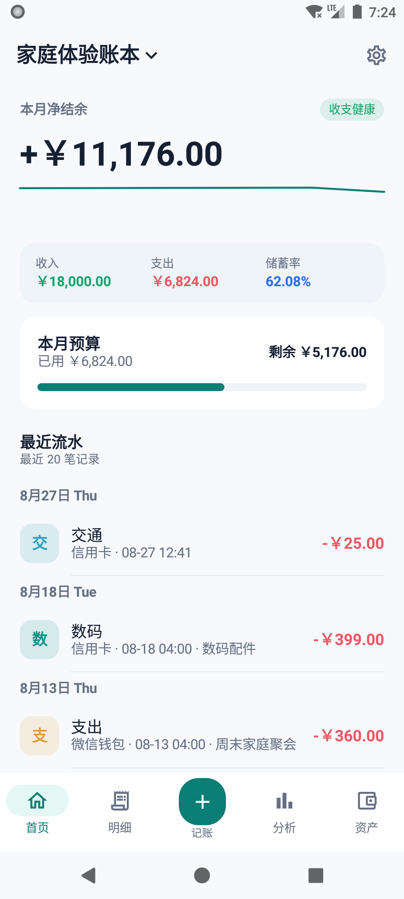
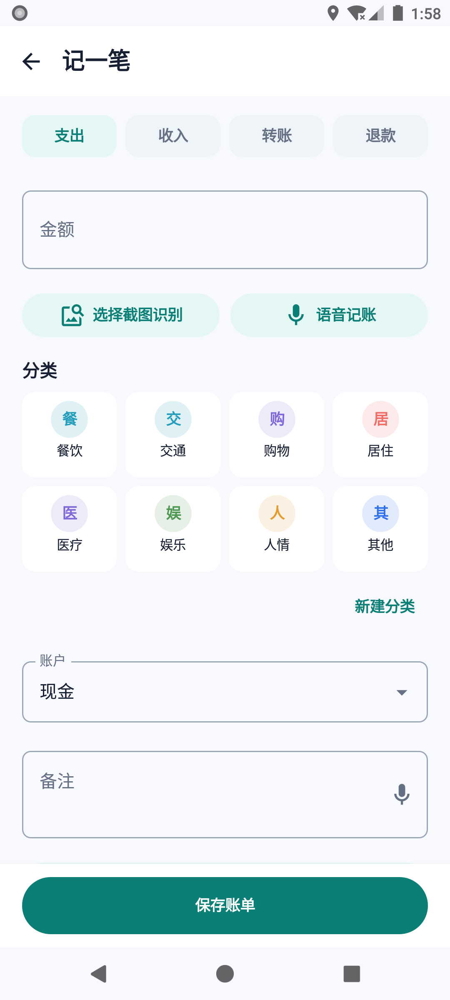
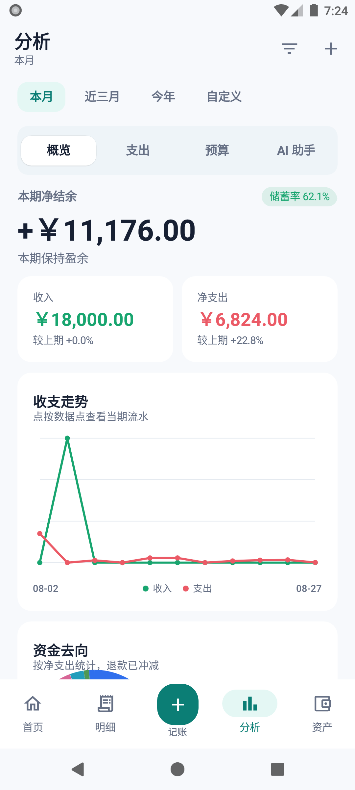

<p align="center">
  
</p>

<h1 align="center">拾账 · Shizhang Finance</h1>

<p align="center">日常收支，随手记下。一个人用，也能和家人一起记。</p>

<p align="center">Offline-first Android expense tracker · Budgets · Self-hosted family sync</p>

<p align="center">
  
  
  
  <a href="LICENSE"></a>
</p>

<p align="center">
  <a href="#screenshots">应用截图</a> ·
  <a href="#features">功能</a> ·
  <a href="#getting-started">开始使用</a> ·
  <a href="#self-hosting">自部署</a> ·
  <a href="#development">开发文档</a>
</p>

拾账是一款离线优先的 Android 记账应用。账单先保存在手机上的加密数据库里，日常记账不需要部署服务器；想在多台设备上同步，或邀请家人共用账本时，再连接自己的服务端。

目前处于预发布阶段，尚未上架应用商店。可以从源码构建体验，记录重要账务前请先做好备份。

<a id="screenshots"></a>

## 📱 看看应用

<table>
  <tr>
    <th width="33%">本月收支</th>
    <th width="33%">记一笔</th>
    <th width="33%">报表分析</th>
  </tr>
  <tr>
    <td><a href="docs/images/home.png"></a></td>
    <td><a href="docs/images/add-transaction.png"></a></td>
    <td><a href="docs/images/reports.png"></a></td>
  </tr>
  <tr>
    <td>打开账本，先看这个月还剩多少预算。</td>
    <td>填金额、选分类和账户，保存一笔账单。</td>
    <td>按时间回看收支，点图表继续查明细。</td>
  </tr>
</table>

截图来自实际运行的应用；首页和报表中的金额均为虚构体验数据。点击图片可查看原图。

<a id="features"></a>

## 🧾 能做什么

| 功能 | 用法 |
| --- | --- |
| ✍️ **日常记账** | 支出、收入、转账、退款、余额调整和拆分账单。支持多账本、多币种，以及分类、标签、商家、项目和附件。 |
| 📊 **收支与预算** | 查看收支趋势和资金去向，按账户、分类、成员筛选，再下钻到对应流水。支持总预算、分类预算和结转。 |
| 👛 **账户管理** | 分开记录现金、银行卡、电子钱包、储蓄、投资和贷款，管理周期账单、分期与存钱目标。 |
| 📥 **导入与备份** | 导入微信、支付宝及通用 CSV/XLSX，先预览重复和错误行；也能导出账单，或创建包含附件的加密备份。 |
| 🏠 **家庭共用** | 自部署服务端，邀请成员加入账本并设置权限。支持增量同步、冲突处理、设备撤销和附件断点续传。 |
| 🪄 **辅助录入** | 本地截图 OCR、文字解析、语音输入、桌面组件和快捷磁贴。支付完成页识别默认关闭，需单独授权。 |

应用也提供可选的 **AI 财务助手**：在“分析 → AI 助手”中使用，自行配置模型服务。发送的是本机计算的聚合结果，不包含原始账单、备注或附件。语音识别优先使用端侧服务；需要系统服务时会先征求同意。

<a id="getting-started"></a>

## 🚀 开始使用

### 1. 构建并安装

准备 **JDK 21、Android SDK 36**，以及一台 Android 8.0 或更高版本的手机或模拟器。

```bash
git clone https://github.com/pthread-t/shizhang-finance.git
cd shizhang-finance
./gradlew :app:assembleDebug
adb install app/build/outputs/apk/debug/app-debug.apk
```

Windows 下将 `./gradlew` 换成 `.\gradlew.bat`。安装前请启用手机的 USB 调试，并确认 `adb devices` 能看到设备。需要完整的环境安装步骤，可看 [Android 调试指南](docs/ANDROID_DEVELOPMENT.md)。

### 2. 记下第一笔

1. 打开应用，进入默认的“日常账本”。普通 Debug/Release 构建可直接离线使用，不需要先登录。
2. 点击底部 **＋ 记账**，选择支出或收入，填写金额，再选分类与账户。例如：支出 `28` 元，分类“餐饮”，账户“现金”。
3. 按需补充备注；标签、商家、项目、附件等字段放在“更多信息”里。点击 **保存账单** 后，回首页查看刚录入的流水。

也可以从记账页选择一张支付截图，或点击“语音记账”。识别完成后先核对金额、分类和账户，再保存。

### 3. 看报表，设预算

打开底部 **分析**，在“本月 / 近三月 / 今年 / 自定义”之间切换。概览查看收支趋势，“支出”查看钱花在哪里；点击图表数据点可以继续查看对应明细。

要控制每月开销，可以进入 **预算** 页签，点击右上角 **＋** 新建总预算或分类预算。首页会展示当前总预算的已用金额和剩余额度。

### 4. 留一份备份

在首页右上角打开 **设置**，使用“导出 CSV / XLSX”保存账单，或选择 **完整备份** 连同附件一起备份。备份密码请单独保管；恢复步骤见[备份与恢复](docs/BACKUP_RESTORE.md)。

<a id="self-hosting"></a>

## ☁️ 和家人一起用

单机记账不依赖服务端。需要同步时，准备一台安装了 Docker Engine 与 Compose v2 的 Linux 主机，以及指向它的域名。

**① 配置域名和密码**

```bash
cp .env.example .env
```

在 `.env` 中填写 `APP_DOMAIN`，分别设置 `POSTGRES_PASSWORD`、`JWT_SECRET` 和 `BACKUP_PASSWORD`。三项使用独立的长随机值，JWT 密钥至少 32 个字符。

**② 启动服务**

```bash
docker compose config --quiet
docker compose up -d --build
docker compose ps
```

开放主机的 80/443 端口，Caddy 会处理 HTTPS 证书。访问 `https://你的域名/health`，正常时返回 `{"status":"ok"}`。数据库不需要开放公网端口。

**③ 连接手机并邀请成员**

在应用 **设置 → 云同步** 中填入自己的 HTTPS 地址并保存，点击“登录”。第一次创建账号时开启 **初始化服务器**，完成后离线保存只显示一次的恢复码。随后可在家庭成员区域生成邀请码，让家人注册并加入账本。

初始化只用于空服务器的首个账号。部署、升级与签名细节见[部署指南](docs/DEPLOYMENT.md)，同步和权限机制见[架构说明](docs/ARCHITECTURE.md)。

## 🧪 体验数据

不想从空账本开始测试，可以使用仓库里的 [`full-year-v1.json`](deploy/fixtures/full-year-v1.json)。它提供虚构账户、分类、商家和项目，配套脚本会生成一年的收支记录，也包含转账、退款、预算等场景。

在**单独的空测试服务器**部署完成后，使用 Windows PowerShell 运行：

```powershell
.\deploy\provision-staging.ps1 `
  -BaseUrl "https://ledger.example.com/api/v1"
```

将示例域名换成自己的测试地址。脚本会初始化服务、创建两个随机密码的测试账号，再通过 API 写入数据；账号凭据以 Windows DPAPI 加密保存到本机 `deploy/.artifacts/`，不会提交到仓库。

体验数据不会打进 APK，也不会自动写入日常使用的服务器。专用 staging 构建需要先登录测试服务器并完成首次同步，与普通离线构建不同。

## 🔒 数据放在哪里

- **手机上**：账务保存到本地加密数据库，可选应用锁与防截屏。
- **自己的服务器上**：只有启用云同步后，数据才同步到配置的服务端。
- **可选外部服务**：模型分析和系统语音识别分别由用户配置或授权，具体数据范围见[隐私与安全说明](docs/PRIVACY.md)。

<a id="development"></a>

## 🛠️ 开发与文档

客户端使用 Kotlin、Jetpack Compose、Room 和 SQLCipher；服务端使用 Ktor、PostgreSQL 与 Flyway。客户端和服务端共用领域模型及同步 DTO。

```text
app/                  Android 客户端
shared/               共用领域模型与同步 DTO
server/               Ktor API 与数据库迁移
deploy/backup/        服务端备份与恢复工具
deploy/fixtures/      虚构体验数据
dev/                  Windows 开发辅助脚本
docs/                 架构、部署、测试和隐私文档
docker-compose.yml    私有云编排
```

提交改动前，可以运行：

```bash
./gradlew :shared:test :server:test :app:testDebugUnitTest
./gradlew :app:compileDebugAndroidTestKotlin
docker compose config --quiet
```

最后一条命令需要先按 `.env.example` 配置本地环境变量。GitHub Actions 会执行相同的单元测试、设备测试源码编译与 Compose 配置检查；设备测试的实际运行方式见下表。

| 文档 | 内容 |
| --- | --- |
| [Android 调试](docs/ANDROID_DEVELOPMENT.md) | Windows 环境、模拟器、构建与日志 |
| [部署与 APK 签名](docs/DEPLOYMENT.md) | HTTPS、容器部署、升级与自有密钥签名 |
| [架构与同步协议](docs/ARCHITECTURE.md) | 领域模型、同步、权限与冲突处理 |
| [测试说明](docs/TESTING.md) | 单元测试、设备测试与发布检查 |
| [备份恢复](docs/BACKUP_RESTORE.md) | 加密备份、校验与恢复演练 |
| [隐私说明](docs/PRIVACY.md) | 权限用途、数据流向与外部服务 |

## 🤝 参与开发

欢迎通过 [Issue](https://github.com/pthread-t/shizhang-finance/issues) 反馈问题，附上应用版本、Android 版本和复现步骤；截图请遮住个人账务和账号信息。准备提交代码时，先看[贡献说明](CONTRIBUTING.md)。安全漏洞请按[安全策略](SECURITY.md)私下报告，不要放在公开 Issue 中。

当前仅提供 Android 客户端和自部署服务端，尚无 iOS、Web 客户端或银行直连。默认本位币为 CNY，默认时区为 Asia/Shanghai。

## 📄 许可证

本项目的原创代码和文档采用 [Apache License 2.0](LICENSE)，允许商用、修改和再分发。分发时请保留版权与许可声明，并标明修改。第三方库和模型仍遵循各自条款，详见[第三方组件说明](THIRD_PARTY_NOTICES.md)。
